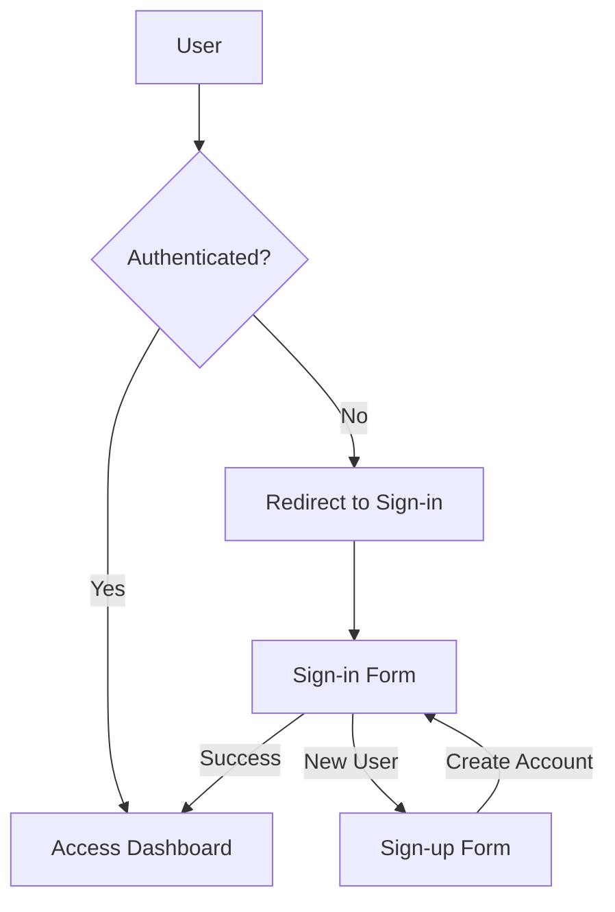

# System Patterns

## Application Architecture

The Admin Dashboard template follows a modern Next.js 15 architecture utilizing the App Router pattern. This document outlines the key architectural decisions, design patterns, and system organization strategies that have been implemented in the project.

### Directory Structure

The project has been organized according to the following directory structure:

```
app-code/
├── src/                      # Source directory
│   ├── app/                  # Next.js app directory
│   │   ├── api/              # API routes
│   │   │   └── auth/         # NextAuth.js API routes
│   │   ├── (auth)/           # Authentication routes
│   │   │   ├── sign-in/      # Sign-in page
│   │   │   ├── sign-up/      # Sign-up page
│   │   │   └── layout.tsx    # Auth layout
│   │   ├── (dashboard)/      # Dashboard routes (protected)
│   │   │   ├── dashboard/    # Main dashboard
│   │   │   ├── data/         # Data management
│   │   │   ├── profile/      # User profile
│   │   │   ├── tasks/        # Task management
│   │   │   └── layout.tsx    # Dashboard layout with sidebar
│   │   ├── page.tsx          # Root page with redirect
│   │   └── layout.tsx        # Root layout with providers
│   ├── components/           # Reusable components
│   │   ├── ui/               # shadcn/ui components
│   │   ├── auth/             # Authentication components
│   │   ├── dashboard/        # Dashboard components
│   │   ├── data-table/       # Table components
│   │   └── tasks/            # Task management components
│   ├── lib/                  # Utility functions and configurations
│   │   ├── auth.ts           # NextAuth.js configuration
│   │   ├── data-service.ts   # Mock data service
│   │   ├── utils.ts          # Helper utilities
│   │   └── validations/      # Zod validation schemas
│   ├── store/                # State management
│   │   └── task-store.ts     # Zustand store for tasks
│   ├── hooks/                # Custom React hooks
│   ├── types/                # TypeScript type definitions
│   └── middleware.ts         # NextAuth.js middleware
├── public/                   # Static assets
└── next.config.ts            # Next.js configuration
```

## Implemented Design Patterns

### Route Groups and Layouts

We've successfully implemented Next.js route groups (denoted by parentheses) to organize routes logically while sharing layouts:

- **`(auth)`**: Groups authentication-related pages that share a common layout with centered content
- **`(dashboard)`**: Groups dashboard pages under a common layout with the sidebar navigation

These route groups allowed us to:
- Logically separate public and protected routes
- Share layouts effectively within each section
- Maintain a clean URL structure without exposing the organizational prefixes

### Component Pattern

The project follows a clear component hierarchy:

1. **UI Components**: Low-level, reusable components from shadcn/ui (Button, Card, Dialog, etc.)
2. **Feature Components**: Specialized components for specific features (SignInForm, TaskCard, DataTable)
3. **Page Components**: Top-level components for routes, composing feature components

This pattern promotes reusability and separation of concerns throughout the application.

### Authentication Implementation

The authentication system has been implemented using NextAuth.js with:

1. **Configuration**: A central auth.ts file in the lib directory defines providers and callbacks
2. **Middleware**: The middleware.ts file protects routes based on authentication status
3. **API Route**: Created the [...nextauth] route handler for authentication requests
4. **Client Integration**: Used useSession hook for client-side access to authentication state
5. **Login/Registration**: Implemented sign-in and sign-up forms with validation



### State Management Implementation

Multiple complementary state management approaches have been implemented:

1. **Global UI State**: Used Zustand for the task management board (with persistence)
2. **Form State**: Implemented with React Hook Form and Zod validation
3. **Local Component State**: React's useState for component-specific state
4. **Mock Data Services**: Created with simulated network delays and CRUD operations

### Data Fetching Implementation

While the current implementation uses mock data services, we've established patterns for:

1. **Service Layer**: Abstracted data operations through service modules
2. **Simulated Latency**: Added artificial delays to simulate network operations
3. **Error Handling**: Implemented consistent error handling patterns
4. **State Synchronization**: Used React state to manage loading and data states

### Form Management Implementation

Forms follow a consistent implementation pattern throughout the application:

1. **Zod Schemas**: Defined validation rules using Zod (see data.ts and task-form.tsx)
2. **React Hook Form**: Connected to shadcn/ui components with proper validation
3. **Form Components**: Created reusable form components with consistent styling and behavior
4. **Error Feedback**: Implemented field-level and form-level error displays
5. **Submission Handling**: Added loading states during form submission

### Table Management Implementation

The data table implementation includes:

1. **Reusable Component**: Created a generic DataTable component with filtering and pagination
2. **Column Definitions**: Type-safe column definitions with customizable cell rendering
3. **CRUD Operations**: Integrated with dialog-based forms for creating, editing, and deleting
4. **Filtering and Search**: Implemented filter controls and search functionality

### Kanban Board Implementation

The task management board has been implemented with:

1. **Drag and Drop**: Used dnd-kit for the drag-and-drop functionality
2. **Column Layout**: Created column-based layout with task status grouping
3. **Task Cards**: Designed interactive task cards with priority indicators
4. **State Management**: Used Zustand with persistence for task state
5. **Task Forms**: Implemented forms for creating and editing tasks

## Communication Patterns

The following communication patterns have been implemented:

1. **Props**: Used for parent-to-child communication
2. **Event Handlers**: Implemented for child-to-parent communication (onEdit, onDelete, etc.)
3. **Global State**: Created Zustand store for widely used state (tasks)
4. **Context**: Used NextAuth session context for authentication

## Error Handling Implementation

Error handling has been implemented at multiple levels:

1. **Form Validation**: Client-side validation prevents invalid data submission
2. **API Error Handling**: Service functions include try/catch blocks with error logging
3. **UI Feedback**: Error states display user-friendly messages
4. **Default Values**: Fallback values prevent UI crashes when data is missing

## Loading States Implementation

Loading states have been implemented using:

1. **Loading Indicators**: Button loading states during form submission
2. **Disabled UI**: Controls are disabled during loading to prevent multiple submissions
3. **Loading State Variables**: React state tracks loading status for UI feedback
